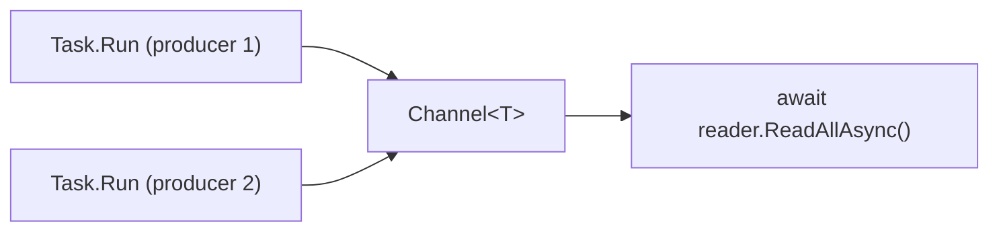

# Concurrency in C#

C# provides a rich concurrency model built on **async/await**, **`Task`**, and **`Channel<T>`**. The `async`/`await` keywords let you write non-blocking code that reads like synchronous code, while `Task` represents a unit of asynchronous work and `Channel<T>` provides a high-performance, thread-safe producer-consumer queue.

---

## 1. Core Concepts

| Concept | Description |
| :--- | :--- |
| **`Task` / `Task<T>`** | Represents an asynchronous operation that may return a value |
| **`async` / `await`** | Syntax for non-blocking asynchronous code |
| **`Task.Run()`** | Schedule CPU-bound work on the thread pool |
| **`Task.WhenAll()`** | Wait for multiple tasks to complete concurrently |
| **`Task.WhenAny()`** | Return as soon as any one task completes |
| **`Channel<T>`** | Typed, async-safe FIFO producer-consumer queue |
| **`lock`** | Mutual exclusion for shared state |
| **`SemaphoreSlim`** | Rate-limiting / async-compatible mutex |
| **`Interlocked`** | Lock-free atomic operations on shared variables |
| **`Lazy<T>`** | Thread-safe deferred initialization (computed once on first access) |

---

## 2. Visual: Task + Channel Producer-Consumer



---

## 3. Implementation Examples

### Launching concurrent work with Task.Run

```csharp
// Fire-and-forget background work
_ = Task.Run(() => DoWork());

// With result — await the Task
var result = await Task.Run(() => ComputeSomething());
```

### Waiting for multiple tasks with Task.WhenAll

```csharp
var tasks = Enumerable.Range(0, 5)
    .Select(i => Task.Run(() => Process(i)));

await Task.WhenAll(tasks);
Console.WriteLine("All done");
```

### Channels

```csharp
var channel = Channel.CreateUnbounded<int>();

// Producer
_ = Task.Run(async () => {
    for (int i = 0; i < 5; i++)
        await channel.Writer.WriteAsync(i);
    channel.Writer.Complete();
});

// Consumer
await foreach (var item in channel.Reader.ReadAllAsync())
    Console.WriteLine(item);
```

### Mutex (lock)

```csharp
private readonly object _lock = new();
private int _count;

public void SafeIncrement()
{
    lock (_lock)
        _count++;
}
```

---

## 4. Pitfalls & Best Practices

> [!WARNING]
> Never use `async void` — exceptions are unobservable and can crash the process. Use `async Task` instead. The only valid use of `async void` is event handlers.

1. `await` does **not** create a new thread — it suspends the current method and returns control to the caller.
2. `Task.Run` schedules on the thread pool — use for CPU-bound work. For I/O use `async`/`await` directly.
3. Don't `task.Result` or `task.Wait()` — this blocks the thread and can cause deadlocks.
4. `Channel<T>` is the idiomatic producer-consumer primitive; avoid `ConcurrentQueue` for new code.

---

## 5. Running the Examples

```bash
dotnet test tests/Basics.Tests --filter "FullyQualifiedName~Concurrency"
```

---

## 6. Further Reading

- [Asynchronous programming (C# docs)](https://learn.microsoft.com/en-us/dotnet/csharp/asynchronous-programming/)
- [System.Threading.Channels](https://learn.microsoft.com/en-us/dotnet/core/extensions/channels)
- [Task Parallel Library](https://learn.microsoft.com/en-us/dotnet/standard/parallel-programming/task-parallel-library-tpl)

---

<details>
<summary>Coming from Go?</summary>

| Go | C# |
|---|---|
| `go func() { ... }()` | `Task.Run(() => ...)` |
| `chan T` | `Channel<T>` |
| `ch <- value` | `await writer.WriteAsync(value)` |
| `v := <-ch` | `var v = await reader.ReadAsync()` |
| `close(ch)` | `writer.Complete()` |
| `select { case v := <-ch: }` | `Task.WhenAny(...)` |
| `sync.WaitGroup` | `Task.WhenAll(tasks)` |
| `sync.Mutex` | `lock` / `SemaphoreSlim` |
| `sync.RWMutex` | `ReaderWriterLockSlim` |
| `sync.Once` | `Lazy<T>` |
| `atomic.AddInt64` | `Interlocked.Add` |

</details>

## Your Next Step
Now that you're running multiple tasks concurrently, you need a way to manage their lifecycles, cancellations, and timeouts.
Explore **[Context & CancellationToken](../Context/README.md)** to learn how to propagate deadlines and signals across your application.
