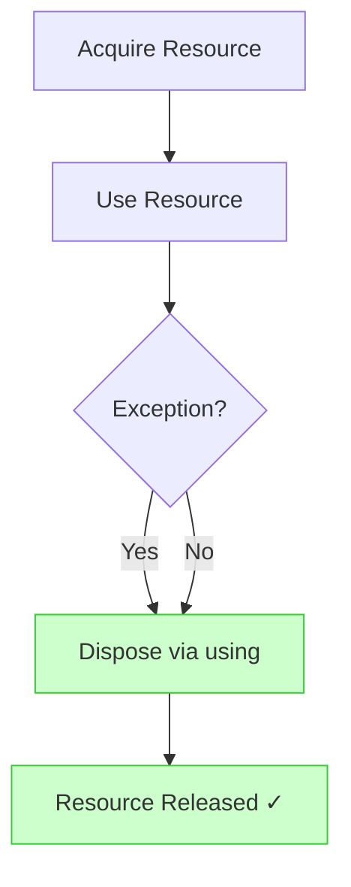

# Disposable & Resource Management

Forgetting to dispose resources is one of the most common bugs in C#. Any type holding unmanaged resources (file handles, database connections, sockets, locks) should implement `IDisposable` — and callers must use `using` to guarantee cleanup.

---

## Why This Matters

Undisposed resources cause:
- **Connection pool exhaustion** — `SqlConnection` not disposed in a loop
- **File locks** — `FileStream` held open prevents other processes from reading
- **Memory leaks** — unmanaged memory not freed until GC finalizer runs (if ever)

## The `using` Statement

The `using` keyword guarantees `Dispose()` is called, even if an exception is thrown:

```csharp
// Block form (classic)
using (var conn = new SqlConnection(connStr))
{
    conn.Open();
    // ... use connection
}   // conn.Dispose() called here

// Declaration form (C# 8+, cleaner)
using var conn = new SqlConnection(connStr);
conn.Open();
// ... use connection
// conn.Dispose() called at end of scope
```

---

## IDisposable Pattern

```csharp
public class MyResource : IDisposable
{
    private bool _disposed;

    public void DoWork()
    {
        ObjectDisposedException.ThrowIf(_disposed, this);
        // ... work with resource
    }

    public void Dispose()
    {
        if (!_disposed)
        {
            // Release resources
            _disposed = true;
        }
    }
}
```

### Full Pattern (with unmanaged resources)

When wrapping native handles, add a finalizer as a safety net:

```csharp
public class NativeWrapper : IDisposable
{
    private nint _handle;
    private bool _disposed;

    protected virtual void Dispose(bool disposing)
    {
        if (!_disposed)
        {
            if (disposing) { /* free managed resources */ }
            // Free unmanaged resources (handle)
            _disposed = true;
        }
    }

    public void Dispose()
    {
        Dispose(true);
        GC.SuppressFinalize(this);
    }

    ~NativeWrapper() => Dispose(false);
}
```

---

## IAsyncDisposable

For resources that need async cleanup (flushing buffers, closing network connections):

```csharp
await using var writer = new StreamWriter("output.txt");
await writer.WriteLineAsync("data");
// writer.DisposeAsync() called here — flushes buffer asynchronously
```



---

## Common Pitfalls

| Pitfall | Problem | Fix |
|---|---|---|
| Forgetting `using` | Resource leak | Always use `using` for `IDisposable` types |
| `new HttpClient()` in a loop | Socket exhaustion | Use `IHttpClientFactory` |
| Dispose then access | `ObjectDisposedException` | Check `_disposed` flag, use `ObjectDisposedException.ThrowIf` |
| Not implementing `IAsyncDisposable` | Sync-over-async disposal | Implement `DisposeAsync()` for async resources |

---

## Running Tests

```bash
dotnet test tests/Basics.Tests --filter "FullyQualifiedName~Disposable"
```

---

[← Back to Basics](../README.md)
