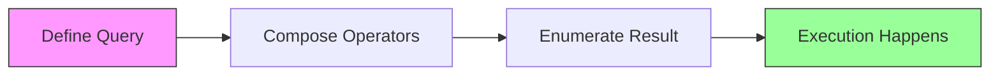

# LINQ — Language Integrated Query

LINQ is the single most impactful C# productivity feature. It provides a unified syntax for querying and transforming data — whether it's an in-memory collection, a database, XML, or JSON.

---

## Why LINQ Matters

Without LINQ, filtering and transforming collections requires manual loops, temporary variables, and nested logic. LINQ replaces all of that with composable, declarative expressions:

```csharp
// Without LINQ
var overdrawn = new List<Account>();
foreach (var account in accounts)
{
    if (account.Balance < 0)
        overdrawn.Add(account);
}

// With LINQ
var overdrawn = accounts.Where(a => a.Balance < 0).ToList();
```

## Two Syntaxes

### Method Syntax (fluent)
```csharp
var result = transactions
    .Where(t => t.Amount > 100)
    .GroupBy(t => t.Owner)
    .Select(g => new { Owner = g.Key, Total = g.Sum(t => t.Amount) });
```

### Query Syntax (SQL-like)
```csharp
var result = from t in transactions
             where t.Amount > 100
             group t by t.Owner into g
             select new { Owner = g.Key, Total = g.Sum(t => t.Amount) };
```

Both compile to the same code. Method syntax is more common in practice.

---

## Deferred Execution

LINQ queries are **lazy** — they don't execute until you enumerate the result:

```csharp
var query = numbers.Where(n => n > 5);  // Nothing happens yet
var list = query.ToList();               // NOW the filter runs
```

This matters because:
- You can compose queries without performance cost
- The source collection can change between query creation and execution
- Operators like `Take()` can short-circuit evaluation



## Common Operators

| Operator | Purpose | Example |
|---|---|---|
| `Where` | Filter | `.Where(x => x > 0)` |
| `Select` | Transform/project | `.Select(x => x.Name)` |
| `GroupBy` | Group elements | `.GroupBy(x => x.Category)` |
| `OrderBy` / `OrderByDescending` | Sort | `.OrderBy(x => x.Date)` |
| `Sum` / `Average` / `Min` / `Max` | Aggregate | `.Sum(x => x.Amount)` |
| `Any` / `All` | Boolean check | `.Any(x => x.IsActive)` |
| `First` / `FirstOrDefault` | Single element | `.First(x => x.Id == 1)` |
| `Take` / `Skip` | Paging | `.Skip(10).Take(5)` |
| `Distinct` | Remove duplicates | `.Select(x => x.Owner).Distinct()` |
| `SelectMany` | Flatten nested | `.SelectMany(x => x.Items)` |

---

## Running Tests

```bash
dotnet test tests/Basics.Tests --filter "FullyQualifiedName~Linq"
```

---

[← Back to Basics](../README.md)
