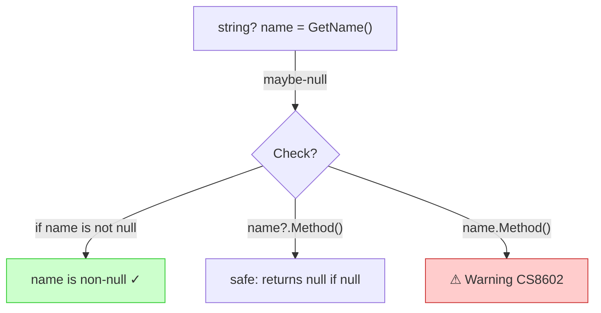

# Nullable Reference Types

C#'s answer to the "billion-dollar mistake." Nullable Reference Types (NRT), enabled by default since .NET 6, let the compiler track null-state and warn you before a `NullReferenceException` ever happens.

---

## Why This Matters

`NullReferenceException` is the most common runtime error in C#. NRT shifts null-safety from runtime crashes to compile-time warnings:

```csharp
string name = null;   // Warning CS8600: Converting null literal to non-nullable type
name.ToUpper();       // Warning CS8602: Dereference of a possibly null reference

string? name = null;  // OK — explicitly nullable
name?.ToUpper();      // OK — null-conditional prevents the crash
```

## Key Annotations

| Syntax | Meaning | Example |
|---|---|---|
| `string` | Non-null reference | `string name = "Alice";` |
| `string?` | Nullable reference | `string? email = null;` |
| `!` | Null-forgiving (suppress warning) | `name!.Length` |
| `?.` | Null-conditional access | `customer?.Email?.Length` |
| `??` | Null-coalescing (default) | `name ?? "unknown"` |
| `??=` | Null-coalescing assignment | `name ??= "default";` |

---

## Null-Safe Patterns

### Guard Clauses
```csharp
// Modern .NET — concise and standard
public void Process(string? input)
{
    ArgumentNullException.ThrowIfNull(input);
    // input is now non-null in the compiler's analysis
    Console.WriteLine(input.ToUpper());
}
```

### Pattern Matching with Null
```csharp
string Describe(object? value) => value switch
{
    null => "nothing",
    string s => $"text: {s}",
    int n when n > 0 => $"positive: {n}",
    _ => $"other: {value}"
};
```

### Null-Coalescing Chain
```csharp
public record Customer(string Name, string? Email, string? Phone)
{
    public string Contact => Email ?? Phone ?? "no contact info";
}
```

---

## How the Compiler Tracks Null



## Configuration

NRT is controlled in your `.csproj`:

```xml
<PropertyGroup>
    <Nullable>enable</Nullable>  <!-- enable | disable | warnings | annotations -->
</PropertyGroup>
```

---

## Running Tests

```bash
dotnet test tests/Basics.Tests --filter "FullyQualifiedName~NullableReferenceTypes"
```

---

[← Back to Basics](../README.md)
