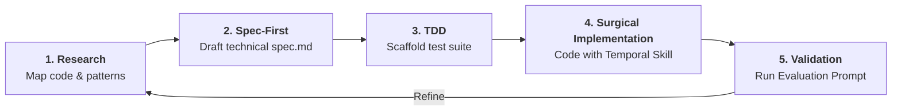
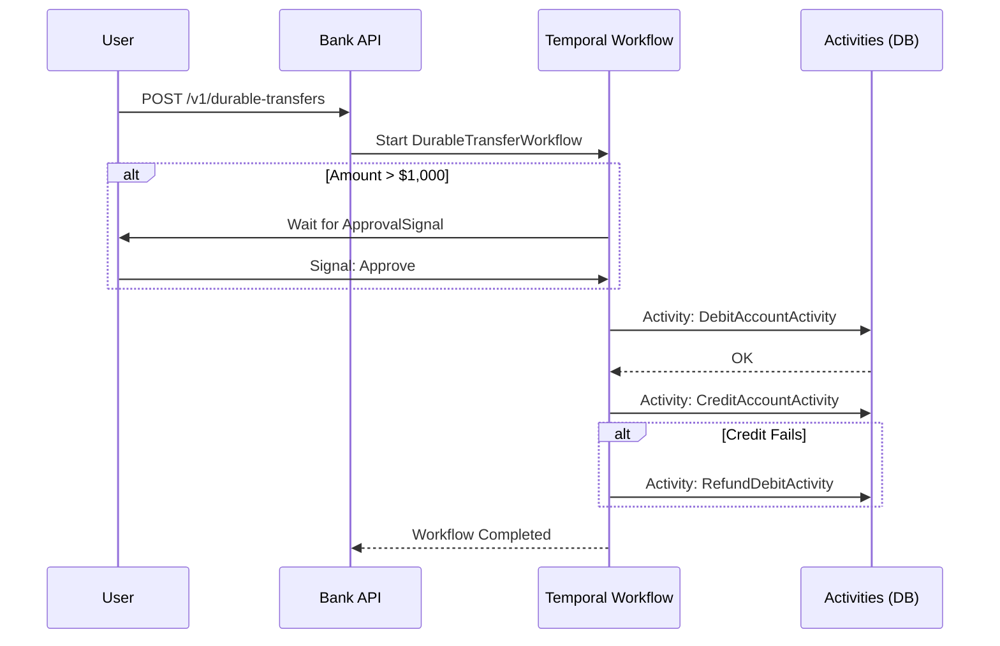

# Durable Transfer Quest: Building a Workflow with Temporal

Welcome to the **Durable Transfer Quest**! In this challenge, you will transform a standard bank transfer into a robust, fault-tolerant **Workflow** using Temporal.

## The Agentic Workflow
In this module, you are the **Architect** and the AI is your **Senior Engineer**. You are expected to follow this "Agentic" loop:



1.  **Research:** Use the agent to read the existing `src/Bank.*` code to understand the repository patterns.
2.  **Spec-First:** Ask the agent to generate a technical specification (`spec.md`) based on the PRD. Do not write code until the spec is clear.
3.  **TDD (Test-Driven Development):** Use the agent to scaffold tests *before* the implementation.
4.  **Surgical Implementation:** Provide the agent with the [Official Temporal Skill](https://github.com/temporalio/skill-temporal-developer) and ask it to implement the workflow and activities.
5.  **Validation:** Use the "Evaluation Prompt" at the end of this guide to have the agent perform a comprehensive audit of your entire lifecycle—from the quality of your technical spec to the robustness of your implementation, tests, and user experience.

## Prerequisites
- **Use the Official Temporal Developer Skill:**
  - This project mandates the use of the [official Temporal Developer Skill](https://github.com/temporalio/skill-temporal-developer).
  - Follow the instructions in the repository to install it for your environment (Gemini, Copilot, Cursor, or Claude Code).
  - Use it to ensure your workflow and activity code follows expert best practices.

---

## Project Foundation

### What is a PRD?
A **Product Requirements Document (PRD)** defines the "What" and "Why" of a feature. It serves as the source of truth for your AI agent. Without a clear PRD, AI agents tend to "hallucinate" features or miss critical business constraints (like approval limits).

**Review the PRD here:** [PRD.md](./PRD.md)

### Architecture Overview
The following diagram illustrates how your durable transfer will be orchestrated:



---

## Your Quests

### Quest 1: Agentic Setup (Preparing your Partner)
To work efficiently, your AI agent needs to understand the "Rules of the Road." In this quest, you will "prime" your agent with the necessary domain knowledge and specialized skills.

**Task:**
1.  **Install the Skill:** Follow the [Official Temporal Developer Skill](https://github.com/temporalio/skill-temporal-developer) instructions to add it to your environment.
2.  **Create your agent instruction file:** Create a configuration file for your AI agent per your tool's conventions (e.g., `CLAUDE.md` for Claude Code, `.cursorrules` for Cursor).
3.  **Define the Context:** In that file, provide a clear instruction for your agent:
    - Point it to `src/Bank.Repository/` to understand how we handle Postgres with EF Core.
    - Point it to `src/Bank.Domain/` to understand our `Account` and `Transfer` entities.
    - Instruct it to ALWAYS use the Temporal Skill for any code involving Workflows or Activities.

**Definition of Done:**
- Ask your agent: *"What are the core repository patterns in this project and which Temporal skill are we using?"*
- The agent should answer accurately without you providing more context.

### Quest 2: Spec & Design (Contract-First)
Now that your agent is "primed," work together to agree on the contract.

> **Note:** `src/Bank.Temporal/` does not exist yet. Create it as a new .NET project as part of this quest. Your `spec.md` will live at `src/Bank.Temporal/spec.md`.

**Task:**
- Read the [PRD.md](./PRD.md).
- Draft a **Technical Specification** (Spec) in a new file `src/Bank.Temporal/spec.md`.
- Define the input/output types for your Workflow and Activities.
- Outline the step-by-step logic of your Workflow, including the compensation logic.

**Definition of Done:**
- Your Spec clearly explains the Workflow flow.
- Your Spec identifies which errors are retryable vs. non-retryable.

### Quest 3: TDD - The Skeleton & Test Suite
We'll start by defining the tests. This ensures our implementation is correct from the start.

**Task:**
- Create `tests/Bank.Temporal.Tests/DurableTransferWorkflowTests.cs`.
- Use the `TemporalWorkerTestEnvironment` from the Temporal .NET SDK.
- Write tests for:
    - **Happy Path:** Success for small amounts.
    - **Approval Path:** Wait for signal, then success.
    - **Rejection Path:** Immediate failure on rejection signal.
    - **Compensation Path:** Simulate a failure in `CreditAccountActivity` and verify `RefundDebitActivity` is called as compensation.

**Definition of Done:**
- Your tests fail to compile (because you haven't written the implementation yet).

### Quest 4: Implement the Durable Transfer Workflow
Now, use your "primed" AI agent to implement the workflow logic based on your spec and tests.

**Task:**
- Implement `DurableTransferWorkflow` in `src/Bank.Temporal/Workflows/DurableTransferWorkflow.cs`.
- Use `Workflow.WaitConditionAsync` for the approval gate — it blocks until the `ApprovalSignal` arrives or the 24-hour timeout expires.
- Use a detached `CancellationToken` (via `CancellationToken.None` or a new `CancellationTokenSource`) inside the compensation branch (when `CreditAccountActivity` returns an error) to ensure compensation runs even if the workflow is externally cancelled.
- Implement the compensation pattern for the credit stage.
- Use `Workflow.ExecuteActivityAsync` for all I/O operations.

**Definition of Done:**
- Your unit tests from Quest 3 pass successfully.

### Quest 5: Implement Idempotent Activities
Now, implement the activities that interact with the database.

**Task:**
- Implement `DebitAccountActivity`, `CreditAccountActivity`, and `RefundDebitActivity` in `src/Bank.Temporal/Activities/TransferActivities.cs`.
- Each activity receives a `transferId` parameter. Use it as a natural idempotency key when writing to the database — check for an existing record with that `transferId` before inserting, or use an `ON CONFLICT DO NOTHING` strategy. This prevents duplicate ledger entries if Temporal retries the activity.
- Map domain exceptions (e.g., `InsufficientFundsException`) to `ApplicationFailureException.NewNonRetryableException(...)` so Temporal does not retry business logic failures.

**Definition of Done:**
- Each activity handles a Temporal retry correctly: running the same activity twice with the same `transferId` produces exactly one ledger entry.

### Quest 6: End-to-End Integration
Connect everything together.

**Task:**
- Wire up a new API endpoint `POST /v1/durable-transfers` that starts the Temporal workflow.
- Start the workflow with a deterministic `WorkflowId` — e.g. `"transfer-" + req.TransferId`. Temporal guarantees that a second `StartWorkflow` call with the same `WorkflowId` returns the existing execution rather than creating a duplicate.
- Create a CLI command `bank-cli transfer approve <workflow-id>` that sends the approval signal.
- Run a manual end-to-end test with a large amount (> $1,000) and approve it via the CLI.

**Definition of Done:**
- You can observe the workflow history in the [Temporal Web UI](http://localhost:8233).
- The funds are correctly moved only after approval.

#### Export & Replay Test (Bonus)
After a successful E2E run, export the workflow history:
```bash
temporal workflow show --workflow-id <your-workflow-id> --output json > src/Bank.Temporal/testdata/transfer_history.json
```
Then write a `Test_ReplayHistory` test using `WorkflowReplayer` to verify your code handles existing histories correctly — the standard safety check before deploying changes to a live workflow.

### Quest 7: Production Hardening (The Final Mile)
In a real system, code doesn't just run; it must be observable and registered correctly.

**Task:**
- **Worker Registration:** Register your new Workflow and Activities in `src/Temporal.Worker/`.
- **Static Analysis:** Run `dotnet build` with warnings-as-errors to catch non-deterministic code patterns. Fix any violations — this is a mandatory gate in production CI pipelines.
- **Trace Propagation:** Use Jaeger (if running) or the Temporal Web UI to verify that your trace ID flows from the HTTP request into the Workflow logic.
- **Idempotency Check:** Manually kill your worker during an activity execution. Upon restart, verify that no duplicate ledger entries exist — the activity's `transferId` check should have prevented the duplicate write.

**Definition of Done:**
- The worker successfully processes your workflow without manual registration errors.
- No duplicate transactions exist in the database after a simulated crash.

## Your Next Step

Congratulations! You've navigated the agentic workflow and built a robust, durable banking operation with Temporal.

Head back to the **[Challenges Overview](../README.md)** to review your progress and find additional resources.

## 💡 Engineering Pro-Tips

### On Observability
Use `Workflow.Logger` inside your workflow. It automatically suppresses logs during "Replay," ensuring your production logs aren't flooded with duplicate entries.

---

## Self-Evaluation & Grading

Once you've finished, use the **Comprehensive Technical Audit** to evaluate your work. This prompt is designed to act as a "Senior Technical Auditor," providing a rigorous, 100-point critique of your entire engineering lifecycle.

**Instructions:**
1. Open [GRADING_PROMPT.md](./GRADING_PROMPT.md).
2. Copy the entire content of the file.
3. Paste it into your AI agent (Claude Code, Gemini, Copilot, or Cursor).
4. Review the detailed feedback and score.

---
[← Back to Main README](../../../README.md)
