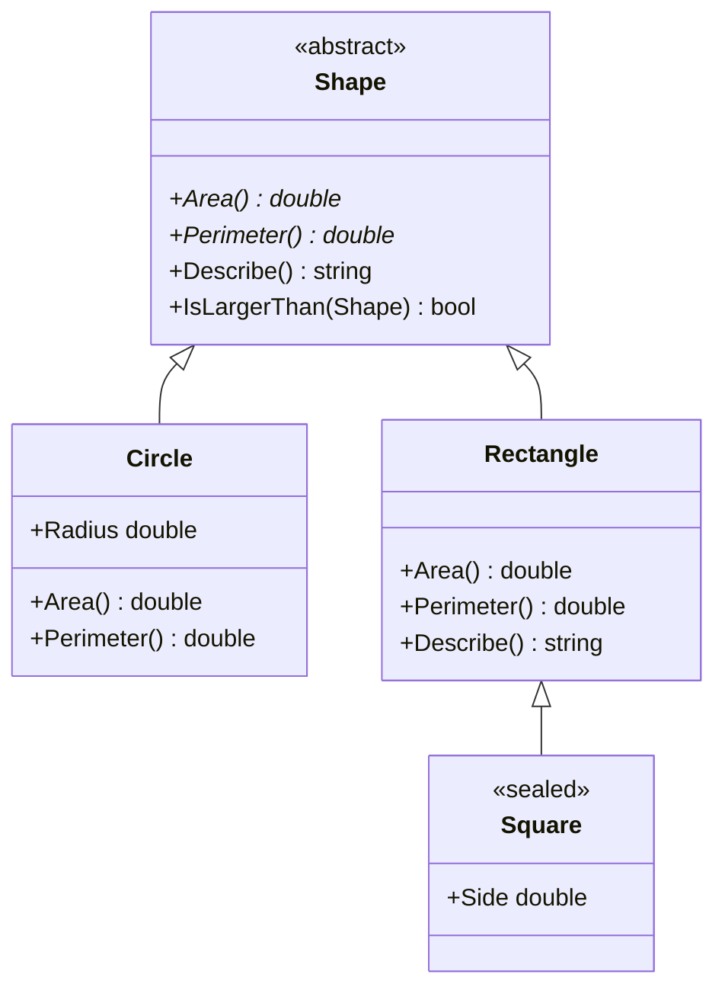

# Abstract Classes in C#

Abstract classes sit between interfaces (all contract, no state) and concrete classes (fully implemented). Use them when you have a family of related types that share some implementation but must differ in specific behaviours.

---

## 1. Core Concepts

| Keyword | Where | Description |
| :--- | :--- | :--- |
| **`abstract class`** | Class | Cannot be instantiated; may contain abstract and concrete members |
| **`abstract`** | Method / property | No implementation; every concrete subclass **must** override |
| **`virtual`** | Method / property | Has a default implementation; subclasses **may** override |
| **`override`** | Method / property | Provides the subclass implementation of an abstract or virtual member |
| **`sealed class`** | Class | Prevents any further subclassing |
| **`sealed override`** | Method | Stops the virtual chain — no further override allowed |
| **`base.Method()`** | Method body | Calls the parent's virtual implementation |

---

## 2. Class Hierarchy



---

## 3. Implementation Examples

### Abstract and virtual members

```csharp
public abstract class Shape
{
    public abstract double Area();        // must override
    public abstract double Perimeter();   // must override

    public virtual string Describe() =>  // may override
        $"{GetType().Name}: area={Area():F2}";

    public bool IsLargerThan(Shape other) => Area() > other.Area();  // can't override
}
```

### Concrete subclass

```csharp
public class Circle(double radius) : Shape
{
    public override double Area()      => Math.PI * radius * radius;
    public override double Perimeter() => 2 * Math.PI * radius;
    // Inherits Describe() from base — no override needed
}
```

### Override the virtual method

```csharp
public class Rectangle(double w, double h) : Shape
{
    public override double Area()      => w * h;
    public override double Perimeter() => 2 * (w + h);

    public override string Describe() =>  // replaces base version
        $"Rectangle {w}×{h}: area={Area():F2}";
}
```

### Sealed class

```csharp
// Cannot be subclassed further — Square is a leaf node
public sealed class Square(double side) : Rectangle(side, side) { }
```

### Template Method Pattern

```csharp
public abstract class DataExporter
{
    // Algorithm skeleton — order of steps is fixed here
    public async Task<string> ExportAsync(IEnumerable<string> data)
    {
        var transformed = Transform(data);   // subclass step 1
        var formatted   = Format(transformed);  // subclass step 2
        return await WriteAsync(formatted);  // virtual with default
    }

    protected abstract IEnumerable<string> Transform(IEnumerable<string> data);
    protected abstract string Format(IEnumerable<string> data);
    protected virtual Task<string> WriteAsync(string content) => Task.FromResult(content);
}

public class UpperCaseCsvExporter : DataExporter
{
    protected override IEnumerable<string> Transform(IEnumerable<string> data) =>
        data.Select(s => s.ToUpperInvariant());

    protected override string Format(IEnumerable<string> data) =>
        string.Join(",", data);
}
```

---

## 4. Abstract Class vs Interface

| | Abstract class | Interface |
| :--- | :--- | :--- |
| **Instantiate directly?** | No | No |
| **Shared state (fields)?** | Yes | No (only static) |
| **Default implementation?** | Yes | Yes (since C# 8), but limited |
| **Multiple inheritance?** | No (one base class) | Yes (implement many interfaces) |
| **Use when** | Shared state + partial implementation | Pure contracts, multiple inheritance |

---

## ⚠️ Pitfalls & Best Practices

1. Prefer **composition over deep inheritance**. More than 2–3 levels of inheritance hierarchy is a design smell.
2. An `abstract` method has no body — don't add `{}` (that makes it empty/virtual, not abstract).
3. `sealed` on a class or method is good practice for leaf nodes: it communicates intent and enables JIT de-virtualisation.
4. Avoid adding new `abstract` members to a published base class — it breaks all existing subclasses.
5. If you have a class where every member is abstract, consider whether an interface is more appropriate.

---

## 🏃 Running the Examples

```bash
dotnet test tests/Basics.Tests --filter "FullyQualifiedName~AbstractClasses"
```

---

## 📚 Further Reading

- [Abstract and sealed classes and class members](https://learn.microsoft.com/en-us/dotnet/csharp/programming-guide/classes-and-structs/abstract-and-sealed-classes-and-class-members)
- [virtual (C# reference)](https://learn.microsoft.com/en-us/dotnet/csharp/language-reference/keywords/virtual)
- [override (C# reference)](https://learn.microsoft.com/en-us/dotnet/csharp/language-reference/keywords/override)

---

## Your Next Step

Now that you understand polymorphism through inheritance, explore the modern C# 12 syntax that makes class and struct definitions more concise.
Explore **[Modern C# Syntax](../ModernSyntax/README.md)** to learn primary constructors, collection expressions, and `with` expressions.
