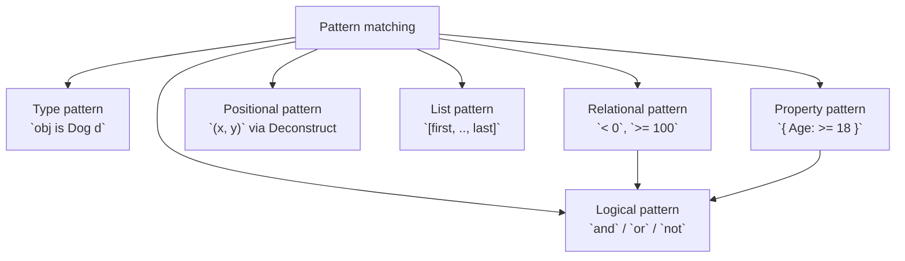

# Advanced Pattern Matching in C#

C# 8–12 added a rich set of patterns that go well beyond simple type checks. These patterns let you express complex conditional logic as concise, exhaustive, compiler-verified switch expressions.

> **See also**: [Type Assertions & Casting](../Casting/) covers the foundational `is`, `as`, and type patterns. This topic focuses on patterns added in C# 8–12.

---

## 1. Core Concepts

| Pattern | Syntax | Description |
| :--- | :--- | :--- |
| **Relational** | `< 0`, `>= 100` | Compare a value with a constant |
| **Logical `and`** | `>= 0 and < 100` | Both sub-patterns must match |
| **Logical `or`** | `Saturday or Sunday` | Either sub-pattern matches |
| **Logical `not`** | `not null`, `not string` | Negates a pattern |
| **Property** | `{ Age: >= 18 }` | Match properties of an object |
| **Extended property** | `{ Address.City: "London" }` | Nested property access (C# 10) |
| **Positional** | `(> 0, > 0)` | Match via `Deconstruct`; records auto-generate this |
| **List** | `[first, .., last]` | Match an array/list by structure (C# 11) |
| **Slice `..`** | `[1, ..]` | Matches zero or more remaining elements |

---

## 2. Pattern Hierarchy



---

## 3. Implementation Examples

### Relational patterns

```csharp
public static string Classify(int score) => score switch
{
    < 0    => "invalid",
    < 60   => "fail",
    < 80   => "pass",
    < 90   => "merit",
    <= 100 => "distinction",
    _      => "invalid"
};
```

### Logical `and` / `or` / `not`

```csharp
// or: any of the listed values
bool isWeekend = day is DayOfWeek.Saturday or DayOfWeek.Sunday;

// and: range check — no intermediate variable needed
bool isWorkHour = hour is >= 9 and <= 17;

// not: exclude a type
string describe = obj switch
{
    null               => "null",
    not string         => "not a string",
    string { Length: 0 } => "empty string",
    string s           => $"string: {s}"
};
```

### Extended property pattern (C# 10)

```csharp
// Old way (C# 8):  p is { Address: { City: "London" } }
// New way (C# 10): p is { Address.City: "London" }
bool livesInLondon = person is { Address.City: "London" };
```

### Positional pattern (via Deconstruct)

```csharp
public record Point(int X, int Y);

string quadrant = point switch
{
    (0, 0)     => "origin",
    (> 0, > 0) => "Q1",
    (< 0, > 0) => "Q2",
    (< 0, < 0) => "Q3",
    (> 0, < 0) => "Q4",
    _          => "axis"
};
```

### List patterns (C# 11)

```csharp
string describe = values switch
{
    []                        => "empty",
    [var x]                   => $"single: {x}",
    [var first, .., var last] => $"starts {first}, ends {last}"
};

bool startsWithOne = values is [1, ..];
bool exactlyThree  = values is [_, _, _];
```

---

## 4. Common Patterns

- **Exhaustive switch expressions**: the compiler warns if a `switch` might miss a case — use `_` as a catch-all.
- **Guard-style property patterns**: `{ Status: "active", Age: >= 18 }` replaces deeply nested `if` chains.
- **Combine with `when` clause**: `score is int n when n > 0` for imperative guards that can't be expressed purely in patterns.

---

## ⚠️ Pitfalls & Best Practices

1. **Order matters** in a switch expression — more specific arms must come before more general ones.
2. **List patterns** require the target to implement `IList<T>` or be an array/`Span`. They don't work on `IEnumerable<T>` directly.
3. **Relational patterns** only work on values the compiler knows are comparable (`int`, `double`, `string`, etc.).
4. The slice pattern `..` in a list pattern matches zero or more elements — it's not a wildcard for a single element.
5. Switch expressions must be **exhaustive** at compile time (or include `_`). This is a feature, not a limitation — use it to make missing cases visible.

---

## 🏃 Running the Examples

```bash
dotnet test tests/Basics.Tests --filter "FullyQualifiedName~AdvancedPatternMatching"
```

---

## 📚 Further Reading

- [Patterns (C# reference)](https://learn.microsoft.com/en-us/dotnet/csharp/language-reference/operators/patterns)
- [Pattern matching overview](https://learn.microsoft.com/en-us/dotnet/csharp/fundamentals/functional/pattern-matching)
- [List patterns (C# 11)](https://learn.microsoft.com/en-us/dotnet/csharp/whats-new/csharp-11#list-patterns)

---

## Your Next Step

Pattern matching is most powerful when combined with well-designed type hierarchies. Explore **[Abstract Classes](../AbstractClasses/README.md)** to learn how `abstract`, `virtual`, and `override` let you build extensible hierarchies that pattern matching can reason about.
