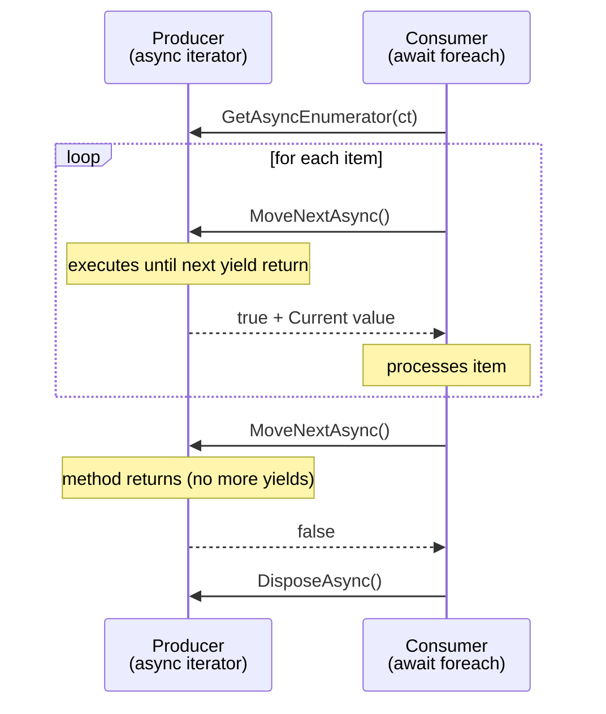

# Async Streams in C#

`IAsyncEnumerable<T>` lets you produce and consume sequences where items arrive over time — from a database cursor, a file, a network stream, or any async source. It combines the pull-based mental model of `IEnumerable<T>` with the non-blocking execution of `async`/`await`.

---

## 1. Core Concepts

| Concept | Description |
| :--- | :--- |
| **`IAsyncEnumerable<T>`** | An async sequence; items are produced one at a time, asynchronously |
| **`yield return` in `async`** | Turns a method into an async iterator; execution suspends at each `yield` |
| **`await foreach`** | Consumes an async sequence without blocking the thread between items |
| **`[EnumeratorCancellation]`** | Attribute that enables `.WithCancellation(ct)` to flow a token into the iterator |
| **`.WithCancellation(ct)`** | Called on the consumer side to pass a `CancellationToken` into the enumerator |
| **Lazy evaluation** | Items are produced on demand — the producer suspends until the consumer asks for the next one |

---

## 2. Visual: Producer → Consumer Interaction



---

## 3. Implementation Examples

### Defining an async iterator

```csharp
public static async IAsyncEnumerable<int> GenerateAsync(
    int count,
    [EnumeratorCancellation] CancellationToken ct = default)
{
    for (int i = 0; i < count; i++)
    {
        ct.ThrowIfCancellationRequested();
        await Task.Delay(10, ct); // simulate async work
        yield return i;
    }
}
```

### Consuming with await foreach

```csharp
await foreach (var item in GenerateAsync(5).WithCancellation(ct))
    Console.WriteLine(item);  // 0, 1, 2, 3, 4
```

### Transform (SelectAsync)

```csharp
var doubled = AsyncStreamExamples.SelectAsync(
    GenerateAsync(3),
    x => x * 2);

await foreach (var item in doubled)
    Console.WriteLine(item);  // 0, 2, 4
```

### Batch (BatchAsync)

```csharp
await foreach (var batch in AsyncStreamExamples.BatchAsync(GenerateAsync(5), size: 2))
    Console.WriteLine(string.Join(", ", batch));
// Output: "0, 1" / "2, 3" / "4"
```

### Streaming file lines

```csharp
using var reader = new StreamReader("large.log");
await foreach (var line in FileLineReader.ReadLinesAsync(reader, ct))
    Process(line);  // one line at a time, no full buffering
```

---

## 4. Async Streams vs Channel\<T\>

| | `IAsyncEnumerable<T>` | `Channel<T>` |
| :--- | :--- | :--- |
| **Direction** | Pull-based (consumer drives) | Push-based (producer drives) |
| **Producers** | Single (one iterator method) | Multiple concurrent writers |
| **Consumers** | Single `await foreach` | Multiple concurrent readers |
| **Backpressure** | Natural — consumer calls `MoveNextAsync` | Bounded channel blocks writer when full |
| **Use when** | Sequential streaming reads, pipelines | Fan-out, fan-in, work queues |

---

## ⚠️ Pitfalls & Best Practices

> [!WARNING]
> Do not call `.Result` or `.Wait()` inside an async iterator — it can deadlock. Always `await` inside async iterators.

1. Always add `[EnumeratorCancellation] CancellationToken ct` as the last parameter so callers can cancel via `.WithCancellation(ct)`.
2. Call `ct.ThrowIfCancellationRequested()` at the top of each loop iteration before producing items.
3. `await foreach` automatically calls `DisposeAsync()` — do not dispose the enumerator manually.
4. `System.Linq.Async` (NuGet) provides a full set of LINQ operators for `IAsyncEnumerable<T>` including `GroupBy`, `OrderBy`, `ToDictionaryAsync`, etc.
5. `Channel<T>.Reader.ReadAllAsync()` returns `IAsyncEnumerable<T>` — the two abstractions compose naturally.

---

## 🏃 Running the Examples

```bash
dotnet test tests/Basics.Tests --filter "FullyQualifiedName~AsyncStreams"
```

---

## 📚 Further Reading

- [Async streams (C# docs)](https://learn.microsoft.com/en-us/dotnet/csharp/asynchronous-programming/generate-consume-asynchronous-stream)
- [IAsyncEnumerable&lt;T&gt; (API reference)](https://learn.microsoft.com/en-us/dotnet/api/system.collections.generic.iasyncenumerable-1)
- [System.Linq.Async (NuGet)](https://www.nuget.org/packages/System.Linq.Async)

---

## Your Next Step

Now that you can stream data asynchronously, explore how to run long-running work in the background with proper host lifecycle management.
Explore **[Background Services](../BackgroundServices/README.md)** to learn `IHostedService` and `BackgroundService`.
