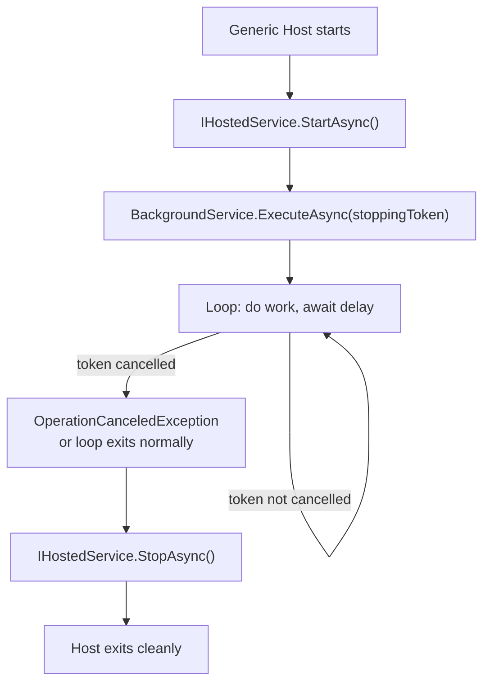

# Background Services in C#

The .NET Generic Host provides first-class support for long-running background work through **`IHostedService`** and its abstract base class **`BackgroundService`**. The host manages service lifetime, graceful shutdown, and exception propagation — no raw `Task.Run` at startup needed.

---

## 1. Core Concepts

| Concept | Description |
| :--- | :--- |
| **`IHostedService`** | Low-level interface: `StartAsync` called on host start, `StopAsync` on shutdown |
| **`BackgroundService`** | Abstract base implementing `IHostedService`; you override only `ExecuteAsync` |
| **`ExecuteAsync(CancellationToken)`** | Your long-running loop — return (or exit) when the token is cancelled |
| **`stoppingToken`** | Triggered by the host on shutdown; pass it to every awaitable inside the loop |
| **`services.AddHostedService<T>()`** | Registers a hosted service in the DI container |
| **`Channel<T>`** | High-performance async-safe FIFO queue; ideal as an in-process work queue |
| **`IBackgroundTaskQueue`** | Application-level abstraction over a `Channel` for queued background work |
| **`Interlocked`** | Lock-free atomic operations — safe counter increments without `lock` |

---

## 2. Visual: Host Lifecycle



---

## 3. Implementation Examples

### Simple periodic service

```csharp
public class TickerService(ILogger<TickerService> logger) : BackgroundService
{
    private int _tickCount;
    public int TickCount => _tickCount;

    protected override async Task ExecuteAsync(CancellationToken stoppingToken)
    {
        try
        {
            while (!stoppingToken.IsCancellationRequested)
            {
                Interlocked.Increment(ref _tickCount);
                logger.LogInformation("Tick {Count}", _tickCount);
                await Task.Delay(TimeSpan.FromSeconds(1), stoppingToken);
            }
        }
        catch (OperationCanceledException) { /* graceful shutdown */ }
    }
}
```

### Queue-based worker

```csharp
// 1. Producer — any service injects IBackgroundTaskQueue and enqueues work
queue.Enqueue(async ct =>
{
    await DoSomeWorkAsync(ct);
});

// 2. Consumer — QueuedWorkerService drains the queue in a loop
protected override async Task ExecuteAsync(CancellationToken stoppingToken)
{
    while (!stoppingToken.IsCancellationRequested)
    {
        try
        {
            var workItem = await queue.DequeueAsync(stoppingToken);
            await workItem(stoppingToken);
        }
        catch (OperationCanceledException) { break; }
        catch (Exception ex) { logger.LogError(ex, "Work item failed"); }
    }
}
```

### Registration

```csharp
// Program.cs
builder.Services.AddBackgroundServices();

// Equivalent to:
// services.AddHostedService<TickerService>();
// services.AddSingleton<IBackgroundTaskQueue, BackgroundTaskQueue>();
// services.AddHostedService<QueuedWorkerService>();
```

### Enqueueing from an HTTP endpoint

```csharp
app.MapPost("/enqueue", (IBackgroundTaskQueue queue) =>
{
    queue.Enqueue(async ct =>
    {
        await Task.Delay(500, ct);  // simulate work
        Console.WriteLine("Background work done");
    });
    return Results.Accepted();
});
```

---

## 4. Common Patterns

### Low-level IHostedService (full control over start/stop)

```csharp
public class ManualService : IHostedService
{
    private Task? _runningTask;
    private CancellationTokenSource? _cts;

    public Task StartAsync(CancellationToken cancellationToken)
    {
        _cts = CancellationTokenSource.CreateLinkedTokenSource(cancellationToken);
        _runningTask = RunAsync(_cts.Token);
        return Task.CompletedTask; // return immediately — don't block startup
    }

    public async Task StopAsync(CancellationToken cancellationToken)
    {
        _cts?.Cancel();
        if (_runningTask is not null)
            await Task.WhenAny(_runningTask, Task.Delay(Timeout.Infinite, cancellationToken));
    }

    private async Task RunAsync(CancellationToken ct) { /* ... */ }
}
```

---

## ⚠️ Pitfalls & Best Practices

> [!WARNING]
> Never use `Task.Run` at application startup to simulate a background service. The host has no visibility into that task — exceptions are swallowed and there is no graceful shutdown.

1. Always pass `stoppingToken` into every `await` inside `ExecuteAsync` so the loop unblocks immediately on shutdown.
2. Catch `OperationCanceledException` at the top of `ExecuteAsync` — don't let it propagate unintentionally.
3. Register `BackgroundTaskQueue` as a **Singleton** — the queue must be the same instance shared by all producers and the single consumer.
4. `BackgroundService.ExecuteAsync` runs on a background thread — avoid accessing scoped DI services directly. Create a scope with `IServiceScopeFactory` for each unit of work.
5. Do not block in `StartAsync` — return quickly and let `ExecuteAsync` carry the long-running work.

---

## 🏃 Running the Examples

```bash
dotnet test tests/Basics.Tests --filter "FullyQualifiedName~BackgroundServices"
```

---

## 📚 Further Reading

- [Background tasks with hosted services (ASP.NET Core docs)](https://learn.microsoft.com/en-us/aspnet/core/fundamentals/host/hosted-services)
- [IHostedService and BackgroundService](https://learn.microsoft.com/en-us/dotnet/core/extensions/hosted-services)
- [System.Threading.Channels](https://learn.microsoft.com/en-us/dotnet/core/extensions/channels)

---

## Your Next Step

Now that you can run long-lived background loops, explore how to stream results back to callers incrementally.
Explore **[Async Streams](../AsyncStreams/README.md)** to learn how `IAsyncEnumerable<T>` and `await foreach` let you produce and consume sequences lazily.
