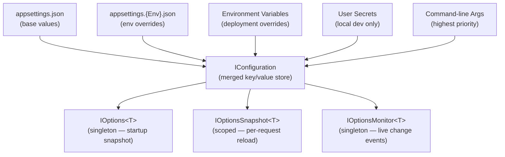

# Configuration in C#

.NET's configuration system loads settings from multiple sources — JSON files, environment variables, user secrets, command-line args — and layers them into a single `IConfiguration`. The Options pattern (`IOptions<T>`) lets you inject strongly-typed settings anywhere in your application.

---

## 1. Core Concepts

| Concept | Description |
| :--- | :--- |
| **`IConfiguration`** | Root interface for reading config values by key; supports hierarchical sections |
| **`appsettings.json`** | Primary config source; loaded automatically by `WebApplication.CreateBuilder()` |
| **Environment variables** | Override `appsettings.json`; use `__` as section separator (`Database__ConnectionString`) |
| **User secrets** | Local developer overrides; never committed to source control (`dotnet user-secrets`) |
| **Command-line args** | Highest-priority override at startup |
| **Layered providers** | Sources stacked — later-registered providers win on key conflicts |
| **`:` separator** | Nested sections accessed with colon: `"Database:ConnectionString"` |
| **`IOptions<T>`** | Binds a config section to a typed class; singleton snapshot, fixed at startup |
| **`IOptionsSnapshot<T>`** | Re-reads config per request/scope; supports reloadable config |
| **`IOptionsMonitor<T>`** | Reacts to config changes at runtime via `OnChange` callback |

---

## 2. Visual Representation



---

## 3. Implementation Examples

### Reading values directly from IConfiguration

```csharp
// Flat key
string? env = config["ASPNETCORE_ENVIRONMENT"];

// Nested key — colon separator
string? conn = config["Database:ConnectionString"];

// Via typed section access
var dbSection = config.GetSection("Database");
string? conn2 = dbSection["ConnectionString"];
```

### Binding a section to a typed record with IOptions&lt;T&gt;

```csharp
// appsettings.json:
// { "Database": { "ConnectionString": "Server=.;Database=mydb", "MaxPoolSize": 20 } }

builder.Services.Configure<DatabaseSettings>(
    builder.Configuration.GetSection("Database"));

// Inject and use
public class DatabaseService(IOptions<DatabaseSettings> options)
{
    private readonly DatabaseSettings _settings = options.Value;
    public bool IsConfigured => !string.IsNullOrEmpty(_settings.ConnectionString);
}
```

### IOptionsSnapshot for per-request reload

```csharp
// Register the same way as IOptions<T>
builder.Services.Configure<FeatureFlags>(
    builder.Configuration.GetSection("FeatureFlags"));

// In a scoped service — re-reads if config changed between requests
public class FeatureService(IOptionsSnapshot<FeatureFlags> snapshot)
{
    public bool DarkModeEnabled => snapshot.Value.EnableDarkMode;
}
```

### IOptionsMonitor to react to live changes

```csharp
public class LiveConfigService
{
    public LiveConfigService(IOptionsMonitor<DatabaseSettings> monitor)
    {
        monitor.OnChange(settings =>
            Console.WriteLine($"Config changed: pool={settings.MaxPoolSize}"));
    }
}
```

### In-memory config for tests

```csharp
var config = new ConfigurationBuilder()
    .AddInMemoryCollection(new Dictionary<string, string?>
    {
        ["Database:ConnectionString"] = "Server=.;Database=test",
        ["Database:MaxPoolSize"] = "5"
    })
    .Build();
```

---

## 4. Common Patterns

### Validate options at startup (fail fast)

```csharp
builder.Services
    .AddOptions<DatabaseSettings>()
    .Bind(builder.Configuration.GetSection("Database"))
    .ValidateDataAnnotations()
    .ValidateOnStart();
```

### Named options — multiple instances of the same type

```csharp
builder.Services.Configure<DatabaseSettings>("Primary",
    builder.Configuration.GetSection("PrimaryDatabase"));
builder.Services.Configure<DatabaseSettings>("Replica",
    builder.Configuration.GetSection("ReplicaDatabase"));

// Resolve by name via IOptionsMonitor
public class ReplicationService(IOptionsMonitor<DatabaseSettings> monitor)
{
    var primary = monitor.Get("Primary");
    var replica  = monitor.Get("Replica");
}
```

---

## ⚠️ Pitfalls & Best Practices

> [!WARNING]
> Never commit secrets (passwords, API keys) in `appsettings.json`. Use `dotnet user-secrets` locally and environment variables or a managed secrets service (e.g. Azure Key Vault) in production.

1. `IOptions<T>.Value` is a **singleton snapshot** — it does not reflect file changes at runtime. Use `IOptionsSnapshot<T>` or `IOptionsMonitor<T>` when you need live reloading.
2. Environment variable separators differ by platform — use `__` (double underscore) instead of `:` for nested keys.
3. Avoid injecting `IConfiguration` directly into domain services — bind it to a typed `IOptions<T>` for testability and explicitness.
4. `IOptionsSnapshot<T>` requires a **scoped or transient** service lifetime — it cannot be injected into singletons.
5. Use `ValidateOnStart()` to catch missing or invalid configuration at application startup rather than at the first access.

---

## 🏃 Running the Examples

```bash
dotnet test tests/Basics.Tests --filter "FullyQualifiedName~Configuration"
```

---

## 📚 Further Reading

- [Configuration in ASP.NET Core](https://learn.microsoft.com/en-us/aspnet/core/fundamentals/configuration/)
- [Options pattern in .NET](https://learn.microsoft.com/en-us/dotnet/core/extensions/options)
- [IOptions vs IOptionsSnapshot vs IOptionsMonitor](https://learn.microsoft.com/en-us/aspnet/core/fundamentals/configuration/options)
- [Safe storage of app secrets](https://learn.microsoft.com/en-us/aspnet/core/security/app-secrets)

---

## Your Next Step

Now that your services are wired up with typed configuration, explore how to run long-lived background processes that read that configuration over their lifetime.
Explore **[Background Services](../BackgroundServices/README.md)** to learn how to build hosted services with proper lifecycle management.
