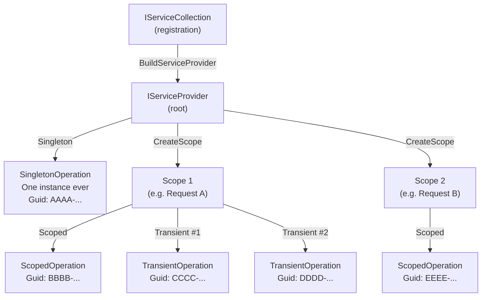

# Dependency Injection in C#

Dependency Injection (DI) is a first-class pattern in .NET. The built-in `Microsoft.Extensions.DependencyInjection` container lets you register services once and resolve them anywhere — without manually constructing object graphs. The container manages object lifetime so you don't have to.

---

## 1. Core Concepts

| Concept | Description |
| :--- | :--- |
| **`IServiceCollection`** | The registration list — add services here at startup |
| **`IServiceProvider`** | The resolver — call `GetRequiredService<T>()` to get an instance |
| **`AddSingleton<T>()`** | One instance for the entire application lifetime |
| **`AddScoped<T>()`** | One instance per scope (one per HTTP request in ASP.NET Core) |
| **`AddTransient<T>()`** | A new instance on every resolution |
| **Constructor injection** | Preferred pattern — declare dependencies as constructor parameters |
| **`IServiceScope`** | A bounded lifetime unit; create with `provider.CreateScope()` |
| **Captive dependency** | Bug: a Scoped service injected into a Singleton, so it never gets released |

---

## 2. Visual Representation



---

## 3. Implementation Examples

### Registering services

```csharp
var services = new ServiceCollection();
services.AddSingleton<SingletonOperation>();   // shared forever
services.AddScoped<ScopedOperation>();         // shared per scope
services.AddTransient<TransientOperation>();   // new every time

ServiceProvider provider = services.BuildServiceProvider();
```

### Constructor injection (preferred)

```csharp
// The container resolves and injects each dependency automatically
public class OperationService(
    SingletonOperation singleton,
    ScopedOperation scoped,
    TransientOperation transient)
{
    public Guid SingletonId { get; } = singleton.OperationId;
    public Guid ScopedId    { get; } = scoped.OperationId;
    public Guid TransientId { get; } = transient.OperationId;
}
```

### Resolving within a scope

```csharp
using var scope = provider.CreateScope();
var a = scope.ServiceProvider.GetRequiredService<ScopedOperation>();
var b = scope.ServiceProvider.GetRequiredService<ScopedOperation>();

// a.OperationId == b.OperationId  ← same instance within one scope
```

### Registration extension method pattern

```csharp
// Group related registrations — keeps Program.cs tidy
public static class ServiceCollectionExtensions
{
    public static IServiceCollection AddOperationServices(this IServiceCollection services)
    {
        services.AddSingleton<SingletonOperation>();
        services.AddScoped<ScopedOperation>();
        services.AddTransient<TransientOperation>();
        return services;
    }
}

// At startup:
builder.Services.AddOperationServices();
```

---

## 4. Common Patterns

### Interface → implementation mapping

```csharp
// Register an interface, resolve the interface
services.AddScoped<IProductRepository, PostgresProductRepository>();

// Resolved by interface — consumer doesn't know the concrete type
public class ProductService(IProductRepository repo) { ... }
```

### Factory registration

```csharp
// Use a factory when construction requires runtime logic
services.AddTransient<IOperation>(_ => new TransientOperation());
```

### Keyed services (.NET 8+)

```csharp
services.AddKeyedSingleton<IOperation, SingletonOperation>("singleton");

// Resolve by key
var op = provider.GetRequiredKeyedService<IOperation>("singleton");
```

---

## ⚠️ Pitfalls & Best Practices

> [!WARNING]
> **Captive dependency**: injecting a **Scoped** service into a **Singleton** means the Scoped instance lives for the entire application lifetime. Enable scope validation to catch this at startup: `services.BuildServiceProvider(validateScopes: true)`.

1. Prefer **constructor injection** over `GetRequiredService<T>()` — dependencies are explicit and testable.
2. **Singletons must be thread-safe** — they are shared across all requests and threads simultaneously.
3. `Transient` services that hold resources (connections, streams) should implement `IDisposable`; the container disposes them at scope end.
4. Group registrations in **extension methods** (`AddMyFeature(this IServiceCollection services)`) rather than inline in `Program.cs`.
5. Use `BuildServiceProvider(new ServiceProviderOptions { ValidateOnBuild = true })` in tests to catch missing registrations eagerly.

---

## 🏃 Running the Examples

```bash
dotnet test tests/Basics.Tests --filter "FullyQualifiedName~DependencyInjection"
```

---

## 📚 Further Reading

- [Dependency injection in .NET](https://learn.microsoft.com/en-us/dotnet/core/extensions/dependency-injection)
- [Service lifetimes](https://learn.microsoft.com/en-us/dotnet/core/extensions/dependency-injection#service-lifetimes)
- [Dependency injection in ASP.NET Core](https://learn.microsoft.com/en-us/aspnet/core/fundamentals/dependency-injection)

---

## Your Next Step

Now that you understand how to register and resolve services with the right lifetime, explore how configuration values are loaded and injected into those services.
Explore **[Configuration](../Configuration/README.md)** to learn how to bind `appsettings.json` sections to typed classes with `IOptions<T>`.
