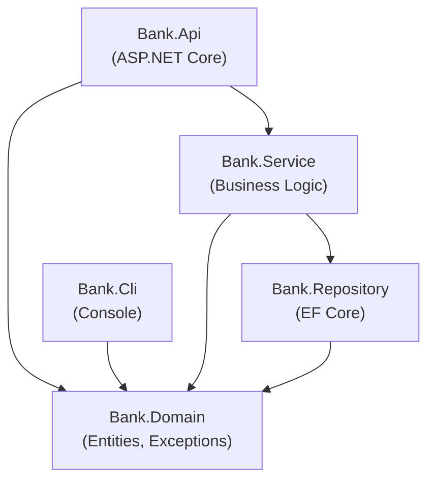

# .NET Project Organization

.NET uses **solutions** (`.sln`) to group related **projects** (`.csproj`), each of which compiles into a single assembly. Combined with namespaces, access modifiers like `internal`, and shared build configuration via `Directory.Build.props`, this system gives you strong encapsulation and clear dependency management out of the box.

---

## 1. Core Concepts

| Concept | Description |
| :--- | :--- |
| **Solution (`.sln`)** | Groups related projects into a single workspace |
| **Project (`.csproj`)** | A single compilable unit that produces an assembly (DLL or EXE) |
| **`internal` access modifier** | Visible only within the same assembly -- enforces module boundaries |
| **Namespace** | Logical grouping within a project (by convention matches folder structure) |
| **`Directory.Build.props`** | Shared MSBuild properties across all projects (centralized config) |

---

## 2. This Repo's Layout

```
DotNetTraining/
├── DotNetTraining.sln          # Solution — groups all projects
├── Directory.Build.props       # Shared settings (TargetFramework, Nullable, etc.)
│
├── src/                        # Production code
│   ├── Hello/                  # Console app (entry point)
│   ├── Bank.Domain/            # Class library — pure domain types (no dependencies)
│   ├── Bank.Repository/        # Class library — data access (depends on Domain)
│   ├── Bank.Service/           # Class library — business logic
│   ├── Bank.Api/               # ASP.NET Core Web API (depends on Service + Domain)
│   ├── Bank.Cli/               # Console app — CLI client
│   ├── Temporal.*/             # Temporal workflow projects
│   └── Shared/                 # Shared utilities referenced by multiple projects
│
├── tests/                      # Test projects
│   ├── Bank.Tests/             # xUnit tests for Bank.*
│   └── Basics.Tests/           # xUnit tests for Basics examples
│
└── workshop/                   # Workshop learning materials
    ├── Basics/                 # 20 topic modules
    └── Fundamentals/           # Docs-heavy API concepts
```

---

## 3. Layered Architecture (Dependency Rules)



**The rule**: dependencies flow inward. Domain has no dependencies. Repository depends on Domain. Service depends on both. API depends on Service.

---

## 📚 Further Reading

- [.NET project SDK](https://learn.microsoft.com/en-us/dotnet/core/project-sdk/overview)
- [Solution files](https://learn.microsoft.com/en-us/visualstudio/ide/solutions-and-projects-in-visual-studio)
- [Clean Architecture in .NET](https://learn.microsoft.com/en-us/dotnet/architecture/modern-web-apps-azure/common-web-application-architectures)

---

<details>
<summary>Coming from Go?</summary>

| Go | C# |
|---|---|
| `go.mod` | `.sln` + `.csproj` |
| `go.sum` | NuGet `packages.lock.json` |
| `cmd/` | Executable projects (`Console`, `WebAPI`, `Worker`) |
| `internal/` | `internal` access modifier; project boundaries enforce visibility |
| `pkg/` | Shared class libraries referenced by multiple projects |
| Package = directory | Namespace = directory (by convention) |
| `go build ./...` | `dotnet build` |
| `go test ./...` | `dotnet test` |
| `go run cmd/app/main.go` | `dotnet run --project src/App` |

</details>

## Your Next Step
After organising your solution, you'll want to learn how to run code at startup and control initialisation order.
Explore **[Initialization & Static Constructors](../Initialization/README.md)** to understand how C# handles type-level initialisation.
