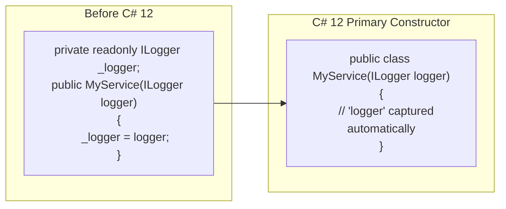

# Modern C# Syntax (C# 9–12)

Each C# release has added concise, expressive syntax that reduces boilerplate without sacrificing readability. This topic covers the most impactful additions from C# 9–12: primary constructors, collection expressions, `with` expressions, and `required` properties.

---

## 1. Core Concepts

| Feature | C# | Description |
| :--- | :--- | :--- |
| **`required`** | 11 | Compiler enforces the property is set at construction time |
| **`init` accessor** | 9 | Property settable only during object initialisation |
| **`with` expression** | 9 | Non-destructive copy of a record (or struct) with changed properties |
| **Record value equality** | 9 | Records compare by value (`==`) not by reference |
| **Record deconstruction** | 9 | Positional records generate `Deconstruct()` automatically |
| **Primary constructors** | 12 | Constructor parameters declared in the class/struct header |
| **Collection expressions** | 12 | `[e1, e2]` literal syntax for any collection type |
| **Spread operator `..`** | 12 | Inline the elements of another collection in a collection expression |

---

## 2. Old vs New: Construction Syntax



---

## 3. Implementation Examples

### Primary constructors (C# 12)

```csharp
// Class: parameters captured as backing fields
public class Point(int x, int y)
{
    public int X => x;
    public int Y => y;
    public double DistanceTo(Point other) =>
        Math.Sqrt(Math.Pow(x - other.X, 2) + Math.Pow(y - other.Y, 2));
}

// Works on structs too
public readonly struct Size(double width, double height)
{
    public double Width  => width;
    public double Height => height;
    public double Area   => width * height;
}

// Common DI pattern
public class OrderService(IEnumerable<string> catalogue)
{
    public bool Exists(string name) =>
        catalogue.Contains(name, StringComparer.OrdinalIgnoreCase);
}
```

### Collection expressions (C# 12)

```csharp
int[]        primes  = [2, 3, 5, 7, 11];        // array
List<string> colours = ["red", "green", "blue"]; // List<T>
string[]     empty   = [];                        // empty

// Spread operator: inline another collection
int[] combined = [..primes, 13, 17];
```

### `with` expressions on records

```csharp
public record Customer(string Name, string Email, Address Address);

// Non-destructive copy — original is unchanged
var updated = customer with { Email = "new@example.com" };

// Nested with — update a nested record
var moved = customer with { Address = customer.Address with { City = "Berlin" } };
```

### Record value equality and deconstruction

```csharp
public record Money(decimal Amount, string Currency);

var a = new Money(10m, "USD");
var b = new Money(10m, "USD");

bool equal = a == b;      // true — value equality
bool same  = ReferenceEquals(a, b);  // false — different objects

// Deconstruction (compiler-generated)
var (amount, currency) = a;
```

### `required` and `init` properties

```csharp
public class UserProfile
{
    public required string Username { get; init; }  // must be set; immutable after
    public required string Email    { get; init; }
    public string? DisplayName      { get; init; }  // optional

    // Compiler error if you forget to set Username or Email:
    // var profile = new UserProfile();  // CS9035
}

// Correct:
var profile = new UserProfile { Username = "alice", Email = "alice@example.com" };
```

---

## 4. Common Patterns

### Primary constructor with guard

```csharp
public class Temperature(double celsius)
{
    // Validate in the body — primary constructor params are available here
    public double Celsius { get; } = celsius is >= -273.15
        ? celsius
        : throw new ArgumentOutOfRangeException(nameof(celsius));
}
```

### `[SetsRequiredMembers]` for custom constructors

```csharp
public class ApiKey
{
    public required string Key     { get; init; }
    public required string Service { get; init; }

    [SetsRequiredMembers]
    public ApiKey(string key, string service)
    {
        Key     = key;
        Service = service;
    }
}

// Works without object initialiser because [SetsRequiredMembers] satisfies the compiler
var key = new ApiKey("abc123", "payments");
```

---

## ⚠️ Pitfalls & Best Practices

1. **Primary constructor parameters are captured** — in a mutable class, reassigning `x = newValue` inside the class modifies the captured field. For mutable state, prefer `public int X { get; set; } = x;` to make the copy explicit.
2. **Collection expressions** work only for types that have a `CollectionBuilderAttribute` or implement the right construction pattern. Standard types (`array`, `List<T>`, `ImmutableArray<T>`, `Span<T>`) all work.
3. **`with` expression** is only available on `record` types (and structs with a custom `Clone`). It does not work on plain `class` types.
4. **`required` + `init` ≠ immutable** after the fact — they only prevent setting after construction. The property itself can still be a reference type whose contents are mutable.
5. **`IOptionsSnapshot<T>`** and similar framework types use `init`-only records — they pair naturally with collection expressions and `with` for test setup.

---

## 🏃 Running the Examples

```bash
dotnet test tests/Basics.Tests --filter "FullyQualifiedName~ModernSyntax"
```

---

## 📚 Further Reading

- [Primary constructors (C# 12)](https://learn.microsoft.com/en-us/dotnet/csharp/whats-new/csharp-12#primary-constructors)
- [Collection expressions (C# 12)](https://learn.microsoft.com/en-us/dotnet/csharp/whats-new/csharp-12#collection-expressions)
- [`with` expression for records](https://learn.microsoft.com/en-us/dotnet/csharp/language-reference/operators/with-expression)
- [`required` modifier](https://learn.microsoft.com/en-us/dotnet/csharp/language-reference/keywords/required)
- [`init` accessor](https://learn.microsoft.com/en-us/dotnet/csharp/language-reference/keywords/init)

---

## Your Next Step

You've completed the C# Language Basics module! Head back to the **[Module 2 Overview](../README.md)** to see all 30 topics, or move on to the hands-on **[Challenges](../../Challenges/README.md)**.
