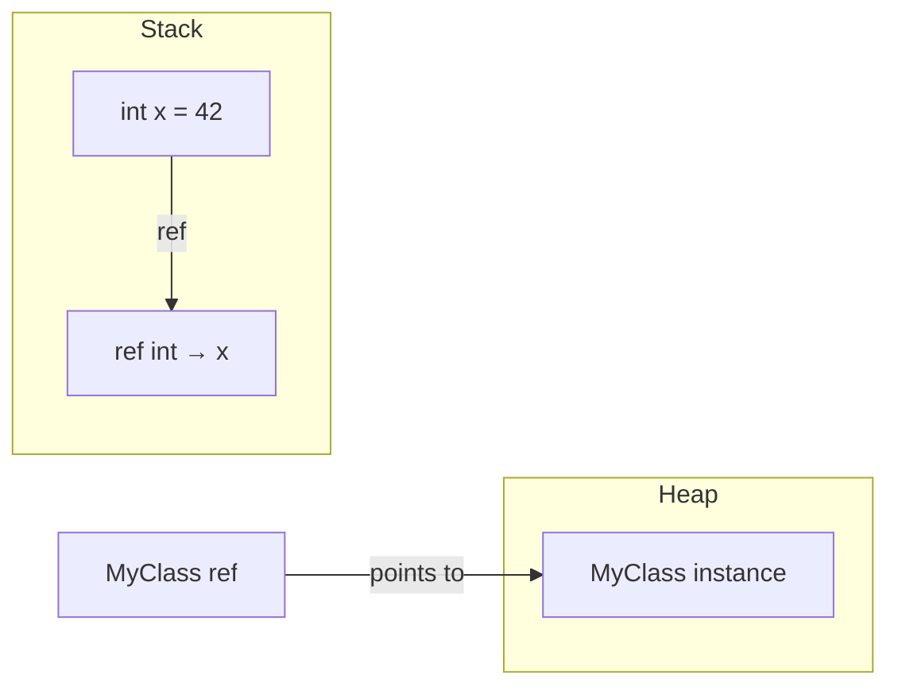

# 📍 Value Types vs Reference Types in C#

In C#, memory semantics are determined by **where a type lives** and **how it is passed**. The type system itself -- structs vs classes -- combined with keywords (`ref`, `out`, `in`) gives you fine-grained control over value vs reference semantics, stack vs heap allocation, and mutation boundaries.

---

## 1. Core Concepts

| Concept | Description |
| :--- | :--- |
| **Value type** | Copied on assignment; lives on stack (or inline in object). Examples: `struct`, `int`, `bool`, `DateTime` |
| **Reference type** | Variable holds a reference (address); lives on heap. Examples: `class`, `string`, `arrays` |
| **`ref` keyword** | Pass a variable by reference — callee can mutate the caller's variable |
| **`out` keyword** | Like `ref` but callee *must* assign before returning (output parameter) |
| **`in` keyword** | Pass by reference, read-only — no copy, no mutation |
| **`null`** | A reference type variable with no object. `NullReferenceException` if dereferenced |
| **`Nullable<T>` / `T?`** | Wrap a value type to allow `null` (e.g. `int?`) |
| **`Span<T>`** | Stack-allocated slice over contiguous memory; safe alternative to raw pointers |

---

## 2. Visual Representation



---

## 3. Implementation Examples

### Value vs Reference copy behaviour

```csharp
// Struct (value type) — copied on assignment
public struct Point { public int X; public int Y; }

var a = new Point { X = 1, Y = 2 };
var b = a;      // full copy
b.X = 99;
Console.WriteLine(a.X); // 1 — a is unchanged

// Class (reference type) — reference copied
public class PointClass { public int X; public int Y; }

var c = new PointClass { X = 1, Y = 2 };
var d = c;      // d points to the same object
d.X = 99;
Console.WriteLine(c.X); // 99 — c is affected!
```

### `ref` parameters -- pass by reference

```csharp
static void Increment(ref int n) => n++;

int x = 10;
Increment(ref x);
Console.WriteLine(x); // 11
```

### `out` parameters

```csharp
static bool TryParse(string s, out int result)
{
    return int.TryParse(s, out result);
}

if (TryParse("42", out int value))
    Console.WriteLine(value); // 42
```

### `Span<T>` — stack-allocated slices

```csharp
Span<int> numbers = stackalloc int[3] { 1, 2, 3 };
numbers[0] = 99;
Console.WriteLine(numbers[0]); // 99
// No heap allocation — safe and GC-free
```

---

## 4. Common Patterns

- **Mutation across methods**: Use `ref` (or a `class` instance)
- **Multiple return values**: Use `out` parameters or return a tuple `(T1, T2)`
- **Optional values**: Use `T?` (nullable) to represent the absence of a value
- **High-perf buffers**: Use `Span<T>` / `Memory<T>` to avoid allocations

---

## ⚠️ Pitfalls & Best Practices

> [!WARNING]
> Accessing a `null` reference throws `NullReferenceException`. Enable nullable reference types (`<Nullable>enable</Nullable>`) to get compiler warnings before runtime.

1. Prefer `class` for mutable, shared, long-lived objects; `struct` for small, immutable, stack-friendly data.
2. Don't overuse `ref` — it makes code harder to reason about. Prefer returning values.
3. `string` is a reference type but is **immutable** — it behaves like a value type in practice.
4. Enable `<Nullable>enable</Nullable>` in your `.csproj` (already set in `Directory.Build.props`) to catch null issues at compile time.

---

## 🏃 Running the Examples

```bash
dotnet test tests/Basics.Tests --filter "FullyQualifiedName~ValueAndReferenceTypes"
```

---

## 📚 Further Reading

- [Value types (C# docs)](https://learn.microsoft.com/en-us/dotnet/csharp/language-reference/builtin-types/value-types)
- [Reference types (C# docs)](https://learn.microsoft.com/en-us/dotnet/csharp/language-reference/keywords/reference-types)
- [`ref`, `out`, `in` parameters](https://learn.microsoft.com/en-us/dotnet/csharp/language-reference/keywords/method-parameters)
- [`Span<T>` and `Memory<T>`](https://learn.microsoft.com/en-us/dotnet/standard/memory-and-spans/memory-t-usage-guidelines)

## Your Next Step
After learning how C# handles value and reference types, you'll often need to control how data flows into your methods.
Explore **[Function Parameters](../Parameters/README.md)** to master how C# handles `params`, optional, and named arguments.
