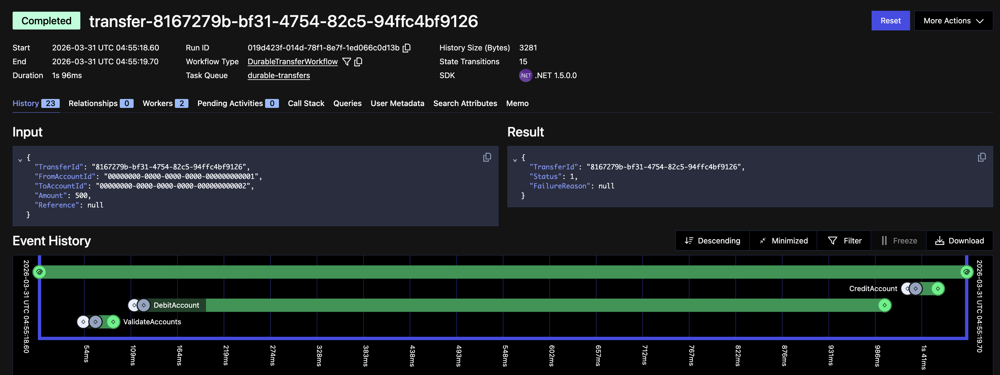
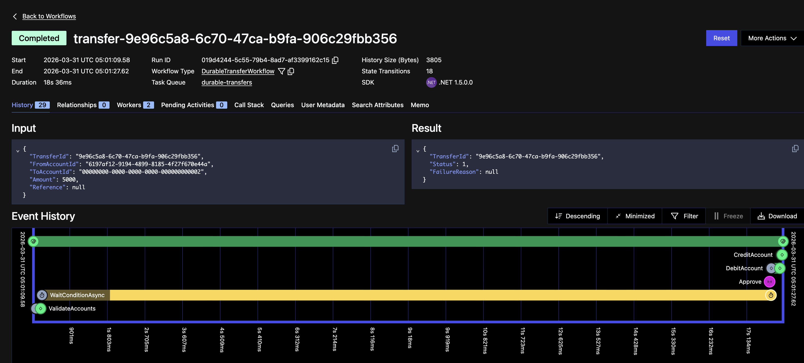
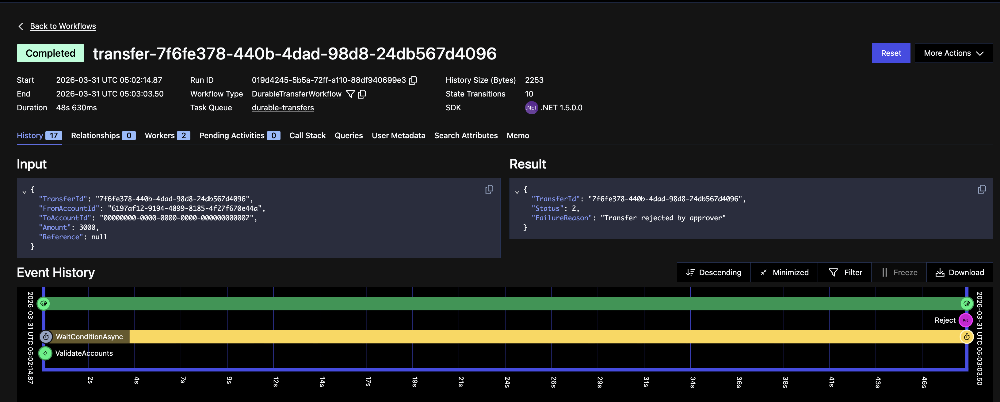
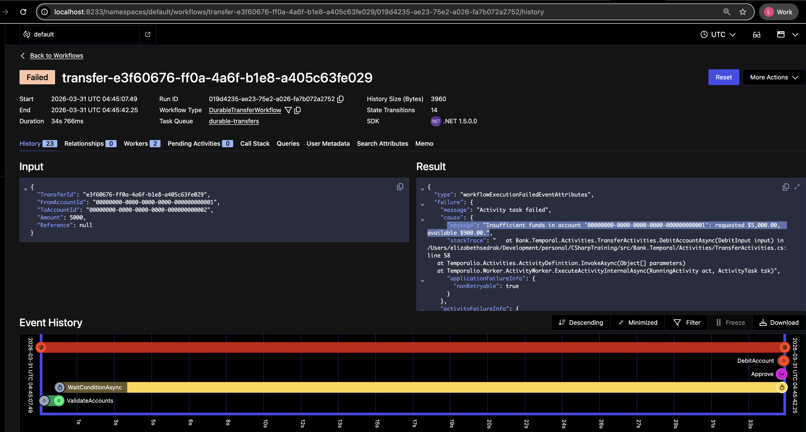

# Durable Transfer E2E — Run Guide

This guide walks you through running the complete end-to-end flow for the Temporal durable transfer implementation (Quests 6-7).

---

## Prerequisites

- Docker Desktop running
- .NET 10 SDK installed
- `jq` installed (`brew install jq`)

---

## Step 1 — Start Infrastructure

Open a terminal in the project root and start Postgres + Temporal:

```bash
make infra-up
```

This starts four containers:

| Service | Port |
|---|---|
| PostgreSQL | 5432 |
| Temporal gRPC | 7233 |
| **Temporal Web UI** | **[http://localhost:8233](http://localhost:8233)** |
| Jaeger UI | 16686 |

Wait ~5 seconds for Temporal to be ready. You can verify at [http://localhost:8233](http://localhost:8233) — you should see the Temporal dashboard.

---

## Step 2 — Migrate and Seed the Database

Run migrations and seed the two development accounts:

```bash
make db-migrate
```

This creates the schema and inserts two accounts with fixed UUIDs you can use in every CLI command:

| Owner | ID |
|---|---|
| alice | `00000000-0000-0000-0000-000000000001` |
| bob | `00000000-0000-0000-0000-000000000002` |

> **Note:** `make db-migrate` is idempotent — re-running it is safe. If you skip it, the accounts won't exist and your transfers will fail validation.

---

## Step 3 — Start the Bank API

> **Must do this AFTER `make infra-up`** — the API connects to Temporal at startup and will fail to start if Temporal is not running.

Open a **new terminal** and keep it running:

```bash
make run-bank-api
```

Wait for:
```
Application started. Press Ctrl+C to shut down.
```

The API is now listening at `http://localhost:5069`.

---

## Step 4 — Start the Temporal Worker

Open another **new terminal** and keep it running:

```bash
make run-worker
```

Wait for both lines:
```
Worker started, listening on task queue 'order-processing'
Durable-transfers worker started, listening on task queue 'durable-transfers'
```

The worker polls Temporal for workflow and activity tasks. Without it running, workflows will start but never execute.

---

## Step 5 — Get a Token

In a **command terminal** (any terminal you use for CLI commands — token must be set here):

```bash
export BANK_TOKEN=$(curl -s -X POST http://localhost:5069/v1/token \
  -H "Content-Type: application/json" \
  -d '{"userName":"admin","scopes":["accounts:write","transfers:write"]}' \
  | jq -r .token)

echo $BANK_TOKEN
```

You should see a long JWT string. If it's empty, the API is not running — go back to Step 3.

> **Important:** `BANK_TOKEN` only exists in the terminal where you ran `export`. Open a new terminal and it will be gone. Set it again in any new terminal you use.

---

## Step 6 — Run a Small Transfer (No Approval)

Transfers of **≤ $1,000** complete automatically without any approval gate.

Alice has $1,000, Bob has $800. Transfer $500 from Alice to Bob:

```bash
dotnet run --project src/Bank.Cli -- durable-transfer create \
  --from 00000000-0000-0000-0000-000000000001 \
  --to 00000000-0000-0000-0000-000000000002 \
  --amount 500
```

Expected output:
```json
{"workflowId":"transfer-<guid>","transferId":"<guid>"}
```

Check the status (replace `transfer-<guid>` with the value from above):
```bash
dotnet run --project src/Bank.Cli -- durable-transfer status transfer-<guid>
```

Expected:
```json
{"workflowId":"transfer-<guid>","status":"Completed"}
```

In the Web UI the event history shows no `WaitConditionAsync` at all — just `ValidateAccounts → DebitAccount → CreditAccount`, completing in under 2 seconds.



---

## Step 7 — Run a Large Transfer (Requires Approval)

Transfers of **> $1,000** pause at an approval gate for up to 24 hours.

Alice only has $1,000 after the seed (or $500 after the previous step), so create a fresh account with enough funds first:

```bash
dotnet run --project src/Bank.Cli -- account create "charlie" --balance 10000
```

Copy the `id` from the response. Then start the large transfer:

```bash
dotnet run --project src/Bank.Cli -- durable-transfer create \
  --from <charlie-account-id> \
  --to 00000000-0000-0000-0000-000000000002 \
  --amount 5000
```

Note the `workflowId` from the response (e.g. `transfer-<guid>`).

**Check the Temporal Web UI** at [http://localhost:8233](http://localhost:8233) — you should see the workflow in **Running** state, blocked on `WaitConditionAsync`.

Now approve it:

```bash
dotnet run --project src/Bank.Cli -- durable-transfer approve transfer-<guid>
```

Expected: `Approved: transfer-<guid>`

Check status again — should now be `Completed`:
```bash
dotnet run --project src/Bank.Cli -- durable-transfer status transfer-<guid>
```

In the Temporal Web UI you'll see the full event timeline: `ValidateAccounts` → `WaitConditionAsync` (yellow, waiting for signal) → `Approve` signal arrives → `DebitAccount` → `CreditAccount` → workflow closes green.



---

## Step 8 — Reject a Transfer

Start another large transfer from Charlie:

```bash
dotnet run --project src/Bank.Cli -- durable-transfer create \
  --from <charlie-account-id> \
  --to 00000000-0000-0000-0000-000000000002 \
  --amount 3000
```

Reject it instead of approving:

```bash
dotnet run --project src/Bank.Cli -- durable-transfer reject transfer-<guid>
```

Status will show `Failed`. The debit is never attempted — funds are untouched.

In the Web UI the workflow closes with `Completed` status (the workflow itself ran to completion) but the result payload shows `"FailureReason": "Transfer rejected by approver"`. The event timeline shows `WaitConditionAsync` spanning almost the full duration, with the `Reject` signal arriving at the very end.



---

## Terminal Layout

Running all of this requires 3+ terminals:

```
Terminal A          Terminal B              Terminal C (commands)
──────────────────  ──────────────────────  ──────────────────────────────────
make infra-up       make run-bank-api       export BANK_TOKEN=$(...)
(docker, stays up)  (stays running)         dotnet run -- durable-transfer ...
                    make run-worker
                    (stays running)
```

> Tip: use a terminal multiplexer (tmux / iTerm split panes) to keep everything visible.

---

## Viewing Workflows in the Temporal Web UI

Go to [http://localhost:8233](http://localhost:8233) after starting a workflow.

- **Workflows tab** — lists all executions, filterable by status
- Click a workflow ID to see its **Event History** — every activity, signal, and timer is logged
- A workflow blocked waiting for approval shows status **Running** with a `WaitConditionAsync` timer event
- After a signal arrives the history shows a `WorkflowSignaledEvent`

---

## Common Pitfalls

### `BANK_TOKEN` is empty
The `export BANK_TOKEN=$(curl ...)` command set it to empty, which means the curl failed — the API wasn't running. Confirm `make run-bank-api` is up, then re-run the export.

### Bank.Api fails to start with a Temporal connection error
The API now connects to Temporal at startup. `make infra-up` must complete before `make run-bank-api`. Check that `http://localhost:8233` loads in your browser.

### Workflow starts but nothing happens / stays Running forever
The worker is not running. Run `make run-worker` in a new terminal and check for the `durable-transfers` listener line.

### `BANK_TOKEN` works in one terminal but not another
`export` only sets the variable in the current shell. Re-run the export in each new terminal you open.

### Insufficient funds on a large transfer after approval
The seeded accounts only have $1,000 (Alice) and $800 (Bob). A transfer of > $1,000 from a seeded account will fail with `InsufficientFundsException` after approval, because the debit runs post-approval. Create a new account with enough balance (Step 7 uses "charlie" with $10,000).

The Web UI shows the workflow as `Failed` — the event history reveals `ValidateAccounts` passed, `WaitConditionAsync` waited for the `Approve` signal, then `DebitAccount` fired and immediately threw a non-retryable `ApplicationFailureException`. Notice `"nonRetryable": true` in the result — Temporal will not retry it.



### `make db-migrate` fails — "PostgreSQL is not ready"
Postgres hasn't finished starting. Wait a few seconds after `make infra-up` and retry.

### 409 Conflict on create
A workflow with that `transferId` is already running or completed. Either wait for it to finish or use a new `--transfer-id <guid>` to force a fresh execution:
```bash
dotnet run --project src/Bank.Cli -- durable-transfer create \
  --from ... --to ... --amount 5000 \
  --transfer-id $(uuidgen | tr '[:upper:]' '[:lower:]')
```

### Status endpoint returns an error after workflow completes
`GetStatus()` is a workflow query — it only works while the workflow is **Running**. On a completed workflow Temporal may return a query-not-supported error. Use the Temporal Web UI to inspect completed workflow results.
